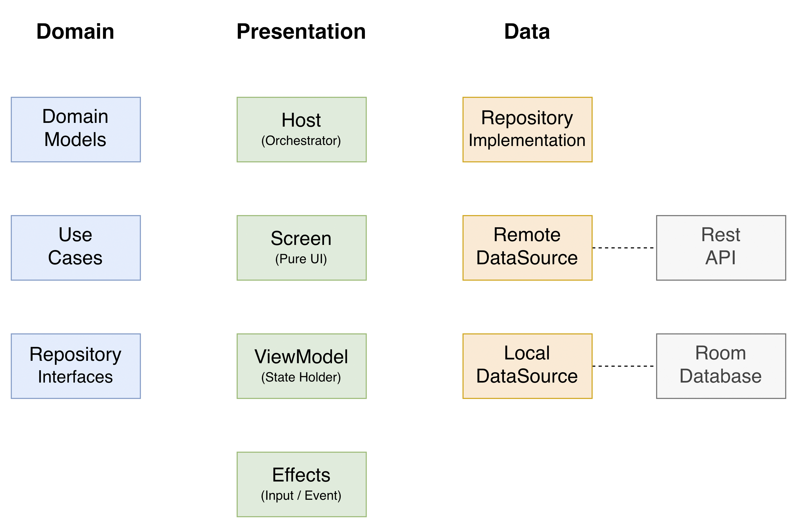
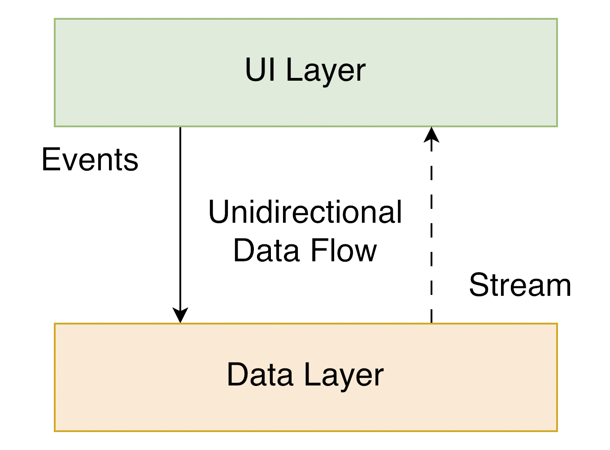
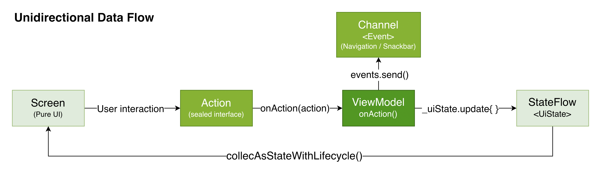
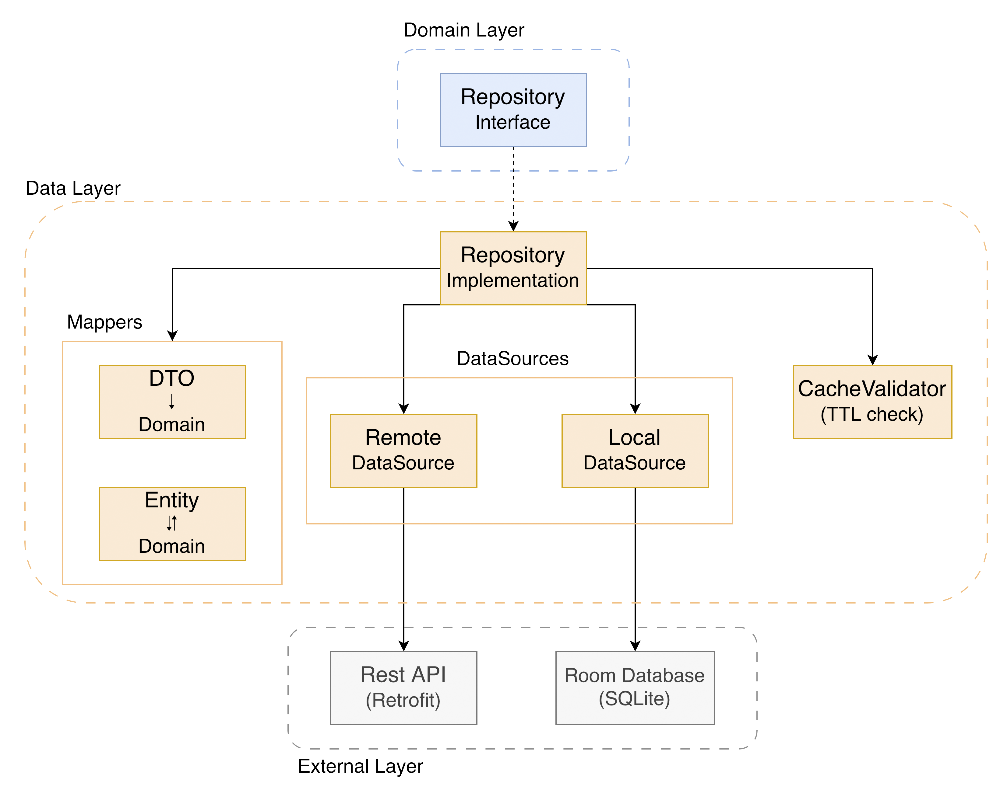
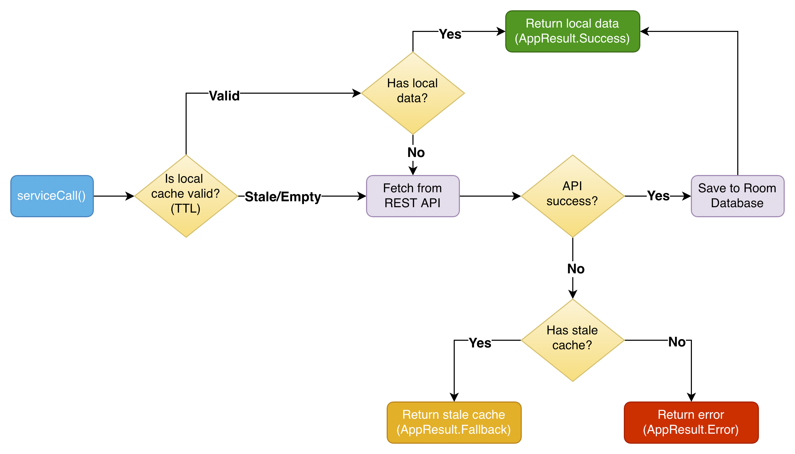

# Countries List

[](https://kotlinlang.org)
[](https://developer.android.com/studio/releases/gradle-plugin)
[](https://developer.android.com/jetpack/compose)
[](https://opensource.org/licenses/MIT)
[](https://android-arsenal.com/api?level=24)

An Android application that displays an interactive list of countries with map integration, search, region filters, and detailed country information. Built with Jetpack Compose, MVVM with MVI principles + Clean Architecture, and an offline-first strategy with local caching.

<table>
  <tr>
    <td align="center"><br/><b>Countries List</b></td>
    <td align="center"><br/><b>Country Details</b></td>
    <td align="center"><br/><b>Map Navigation</b></td>
  </tr>
</table>

## Download

Go to the [Releases](https://github.com/leanite/countries-list/releases) to download the latest APK.

## Tech Stack

Built with modern Android development tools and libraries, prioritizing stability and production-readiness.

**Core:**

- **[Kotlin 2.3+](https://kotlinlang.org/)** - Modern, expressive programming language
  - **[Coroutines](https://kotlinlang.org/docs/coroutines-overview.html)** - Asynchronous programming
  - **[Flow](https://kotlinlang.org/docs/flow.html)** - Reactive data streams
  - **[KSP](https://kotlinlang.org/docs/ksp-overview.html)** - Kotlin Symbol Processing
  - **[Serialization](https://kotlinlang.org/docs/serialization.html)** - JSON parsing

**Android Jetpack:**
- **[Compose](https://developer.android.com/jetpack/compose)** - Declarative UI framework
- **[Navigation 3](https://developer.android.com/guide/navigation/navigation-3)** - Type-safe screen navigation with NavDisplay
- **[ViewModel](https://developer.android.com/topic/libraries/architecture/viewmodel)** - UI state management
- **[Room](https://developer.android.com/jetpack/androidx/releases/room)** - Local database with SQLite
- **[Lifecycle](https://developer.android.com/jetpack/androidx/releases/lifecycle)** - Lifecycle-aware components

**Networking & Images:**
- **[Retrofit 3](https://square.github.io/retrofit/)** - HTTP client for API communication
- **[OkHttp](https://square.github.io/okhttp/)** - Underlying HTTP client
- **[Coil](https://github.com/coil-kt/coil)** - Image loading optimized for Compose (with SVG support)

**Dependency Injection:**
- **[Hilt](https://dagger.dev/hilt/)** - Dependency injection framework built on Dagger

**Maps:**
- **[Google Maps Compose](https://developers.google.com/maps/documentation/android-sdk/maps-compose)** - Google Maps integration with Compose

**Architecture:**
- **[Clean Architecture](https://blog.cleancoder.com/uncle-bob/2012/08/13/the-clean-architecture.html)** - Separation of concerns with defined layers
- **Single Activity Architecture** - Modern single-Activity navigation approach
- **MVVM with MVI principles** - Reactive presentation-layer pattern providing a single source of UI state through unidirectional data flow (UDF)
- **Modular Design** - Feature-based modules for scalability

**UI & Design:**
- **[Material Design 3](https://m3.material.io/)** - Latest design system
- **[Kotlinx Collections Immutable](https://github.com/Kotlin/kotlinx.collections.immutable)** - Immutable collections for Compose optimization

**Testing:**
- **[JUnit 4](https://junit.org/)** - Testing framework
- **[MockK](https://mockk.io/)** - Kotlin-first mocking library
- **[Compose Testing](https://developer.android.com/jetpack/compose/testing)** - UI testing with Compose

**Code Quality:**
- **[Detekt](https://github.com/arturbosch/detekt)** - Static analysis and complexity checks
- **[KtLint](https://github.com/pinterest/ktlint)** - Kotlin code formatting and issue detection

**Build:**
- **[Gradle Kotlin DSL](https://docs.gradle.org/current/userguide/kotlin_dsl.html)** - Type-safe build scripts
- **[Version Catalogs](https://docs.gradle.org/current/userguide/platforms.html#sub:version-catalog)** - Centralized dependency management
- **[Convention Plugins](https://docs.gradle.org/current/samples/sample_convention_plugins.html)** - Shared build logic

## Architecture

**Countries List** follows MVVM + MVI + Clean Architecture with multi-modules, aligned with [Google's official architecture guidance](https://developer.android.com/topic/architecture).



### Architecture Overview

The architecture is structured into three distinct layers: Presentation, Domain, and Data. Each layer has specific responsibilities, and dependencies always point inward (features depend on core, never the other way around).

| Layer | Module(s) | Responsibility |
|-------|-----------|----------------|
| **Domain** | `core-domain` | Models, repository interfaces, use cases, AppResult/AppError |
| **Data** | `core-data` | Repository implementations, data sources, mappers, DI, network, database |
| **Presentation** | `feature-list`, `feature-details` | MVVM + MVI: Host/Screen/Effects, Contract, ViewModel |

- Each layer follows [Unidirectional Data Flow](https://developer.android.com/topic/architecture/ui-layer#udf): the UI emits actions to the ViewModel, and the ViewModel exposes state as a stream via `StateFlow`.
- The Data layer is independent from other layers and follows the [Single Source of Truth](https://en.wikipedia.org/wiki/Single_source_of_truth) principle.
- The Domain layer has no Android dependencies.

### Presentation Layer



This layer is closest to what the user sees on the screen. It combines `MVVM` structure with `MVI` behavior through `UDF` (Unidirectional Data Flow):

- `MVVM` — Jetpack `ViewModel` encapsulates UI state and exposes it via an observable state holder (`StateFlow`)
- `MVI` — User intentions are modeled as `Actions` (sealed interface), processed through a single `onAction()` entry point, producing a new immutable `UiState` — forming a unidirectional cycle: UI → Action → ViewModel → State → UI

The common state is a single source of truth for each screen. State is collected via `collectAsStateWithLifecycle()`, ensuring [lifecycle-aware collection](https://medium.com/androiddevelopers/consuming-flows-safely-in-jetpack-compose-cde014d0d5a3) with no wasted resources. All state types are annotated with [`@Immutable`](https://developer.android.com/reference/kotlin/androidx/compose/runtime/Immutable) to enable Jetpack Compose composition optimizations.

The UI layer implements the **Host / Screen / Effects** pattern:

Components:

- **Host** (`CountriesListHost`) — Root composable that orchestrates the feature. Injects the ViewModel via `hiltViewModel()`, collects state with `collectAsStateWithLifecycle()`, and wires together InputEffects, EventEffects, and Screen. The Host is the only composable that knows about the ViewModel.
- **Screen** (`CountriesListScreen`) — Pure UI composable. Receives only immutable data (`UiState`) and an `onAction` callback. Has no access to the ViewModel, making it independently testable by simply passing static state.
- **ViewModel** (`CountriesListViewModel`) — Processes user actions and emits state changes. Exposes a single public method `onAction()` as the entry point for all user intentions. All internal logic is `private`. Uses `MutableStateFlow` internally, exposed as immutable `StateFlow`.
- **InputEffects** (`CountriesListInputEffects`) — Triggers initial actions on first composition (e.g., `Load` to fetch data).
- **EventEffects** (`CountriesListEventEffects`) — Consumes one-shot events that are not state (navigation, snackbar, camera animation) via `Channel<Event>`. Events are consumed once and discarded, avoiding re-execution on recomposition.
- **Contract** (`CountriesListContract`) — Defines the complete UI contract for the feature in a single file.

Each feature defines a **Contract** with four types:

| Type | Responsibility |
|------|---------------|
| **UiState** | Current screen state — a `data class` annotated with `@Immutable`, serving as the single source of truth |
| **Action** | User intentions (e.g., `SearchQueryChange`, `CountryClick`) — a `sealed interface` consumed by `onAction()` |
| **Event** | One-shot effects like navigation and snackbar — a `sealed interface` emitted via `Channel` |
| **Message** | Message types for user-facing display (e.g., error messages) — a `sealed interface` resolved to `String` in EventEffects |

### Domain Layer

This is the core layer of the application. The Domain layer is independent of any other layers and has no Android framework dependencies. This allows domain models and business logic to remain decoupled — changes in the database (Data layer) or screen UI (Presentation layer) will not result in code changes within the Domain layer.

Components:

- **UseCase** — Contains business logic for a single operation. Uses `operator fun invoke()` for natural call-site syntax (e.g., `getAllCountriesUseCase()`) and returns `AppResult<T>`. Shared use cases live in `core-domain/usecase/`, while feature-specific use cases (those that depend on UI models) remain in their feature module:
  - `GetAllCountriesUseCase` — Fetches, validates, and sorts all countries
  - `GetCountryDetailsUseCase` — Fetches detailed information for a specific country
  - `GetBorderCountriesUseCase` — Fetches bordering countries for a given country
  - `BuildCountrySectionsUseCase` *(feature-list)* — Organizes countries into alphabetical sections
  - `CalculateCountryTargetZoomUseCase` *(feature-list)* — Calculates map zoom level based on country area
- **Domain Model** — Defines the core data structures used throughout the application. This is the source of truth for application data: `Country`, `CountryDetails`, `Location`, `Currency`, `Border`, `Continent`, and the `CountryCode` value class for type safety.
- **Repository Interface** (`CountryRepository`) — Required to keep the Domain layer independent from the Data layer ([Dependency Inversion](https://en.wikipedia.org/wiki/Dependency_inversion_principle)). The Data layer provides the concrete implementation.
- **AppResult** — A `sealed interface` (`Success<T>` / `Error`) that encapsulates operation outcomes, ensuring the UI never sees raw exceptions.
- **AppError** — A `sealed interface` that defines known error types (`NoInternet`, `ServerError`, `NotFound`, etc.), providing a type-safe error hierarchy.

### Data Layer



Encapsulates application data. Provides data to the Domain layer by retrieving it from the network and caching it in a local database for offline access.

Components:

- **Repository** - Exposes data to the Domain layer. Merges, filters, and transforms data from multiple sources to create a high-quality data source. It is the Repository's responsibility to construct Domain models by reading from Data Sources and to implement the offline-first caching strategy with TTL validation.
- **Mapper** - Maps data models to domain models via extension functions (e.g., `CountryDTO.toDomain()`, `CountryEntity.toDomain()`), keeping the Domain layer independent from the Data layer.

This application has two Data Sources — **Retrofit** (network access) and **Room** (local persistent storage). Each data source consists of multiple classes:

**Retrofit (Remote):**
- **Retrofit Service** (`CountriesApiService`) - Defines the REST API endpoints
- **DTO Models** (`CountryDTO`, `CountryDetailsDTO`) - Definition of network response objects with serialization annotations

**Room (Local):**
- **Room Database** (`CountriesDatabase`) - Persistence database for caching app data
- **Room DAO** (`CountryDAO`, `CountryDetailsDAO`, `CacheMetadataDAO`) - Data access objects to interact with stored data
- **Room Entity** (`CountryEntity`, `CountryDetailsEntity`, `CacheMetadataEntity`) - Definition of stored objects with Room annotations

Both DTOs and Entities contain framework-specific annotations so that Kotlin Serialization and Room understand how to parse data into objects. The mapping pipeline follows: `DTO (API) → Domain Model ↔ Entity (Room)`.

### Data Flow

The repository implements offline-first with TTL-based cache validation:



Users don't need to be online to use the app. The TTL cache avoids unnecessary API calls, and the fallback ensures stale data is better than an error screen.

## Modularization

The project adopts modularization strategies for:

- **Reusability**: Reusable code is properly modularized with restricted access between modules.
- **Parallel Building**: Each module can be compiled in parallel, reducing build time.
- **Strict Visibility Control**: Modules expose only dedicated components via `internal`.
- **Decentralized Focus**: Each module can be developed independently.

```
countries-list/
├── app/                          # Entry point, navigation, theme
├── build-logic/convention/       # Gradle convention plugins
├── core/
│   ├── core-domain/              # Models, repository interfaces, use cases, AppResult, AppError
│   ├── core-data/                # Repositories, data sources, mappers, DI, network, database
│   ├── core-ui/                  # Shared Compose components
│   ├── core-bottom-sheet/        # Custom draggable bottom sheet component
│   └── core-testing/             # Testing utilities
└── feature/
    ├── feature-list/             # Countries list + map + search + filters
    └── feature-details/          # Country details + borders
```

### Feature Module Structure

Each feature module contains Clean Architecture internally:

```
feature-list/
├── CountriesListHost.kt          # Orchestrator (connects ViewModel, Effects, Screen)
├── CountriesListScreen.kt        # Pure UI (receives UiState + onAction)
├── CountriesListViewModel.kt     # State holder (onAction as single public entry point)
├── CountriesListContract.kt      # UiState, Action, Event, Message
├── CountriesListInputEffects.kt  # Initial actions (LaunchedEffect)
├── CountriesListEventEffects.kt  # One-shot events (navigation, snackbar)
├── usecase/                      # Feature use cases
│   ├── GetAllCountriesUseCase.kt
│   ├── BuildCountrySectionsUseCase.kt
│   └── CalculateCountryTargetZoomUseCase.kt
├── ui/                           # Internal composables
│   ├── CountriesBottomSheet.kt
│   ├── list/
│   │   ├── CountryList.kt
│   │   ├── CountryItem.kt
│   │   └── AlphabetIndexBar.kt
│   └── preview/
└── extension/                    # Extension functions
```

### Convention Plugins

[Convention Plugins](https://docs.gradle.org/current/samples/sample_convention_plugins.html) standardize build configuration across modules by encapsulating common build logic into reusable plugins:

| Plugin | Usage |
|--------|-------|
| `countries.android.application` | App module configuration |
| `countries.android.library` | Library module configuration |
| `countries.android.feature` | Feature modules (combines library + compose + hilt + common deps) |
| `countries.android.data` | Data module (Room + Retrofit + Serialization) |
| `countries.android.compose` | Compose configuration |
| `countries.android.hilt` | Hilt + KSP |

The `countries.android.feature` plugin automatically includes `core-domain` and `core-ui` as dependencies, along with Lifecycle, ViewModel, Hilt Navigation, Coroutines, Coil, and Retrofit.

## Code Verification

```bash
# Debug build
./gradlew :app:assembleDebug

# Run unit tests
./gradlew test

# Run instrumented tests
./gradlew connectedCheck

# Run linting checks
./gradlew ktlintCheck detekt

# Auto-fix formatting
./gradlew ktlintFormat
```

## Open API

<a href="https://restcountries.com/" target="_blank">
</a>

Countries List uses the [REST Countries API](https://restcountries.com/) to fetch country data. The API is public and requires no authentication.

Endpoints used:
- `GET /v3.1/all` - Lists all countries (with selected fields)
- `GET /v3.1/alpha/{code}` - Details for a specific country

## Author

**Leandro Carneiro** - Android Developer

[](https://github.com/leanite)
[](https://www.linkedin.com/in/lcleite/)
